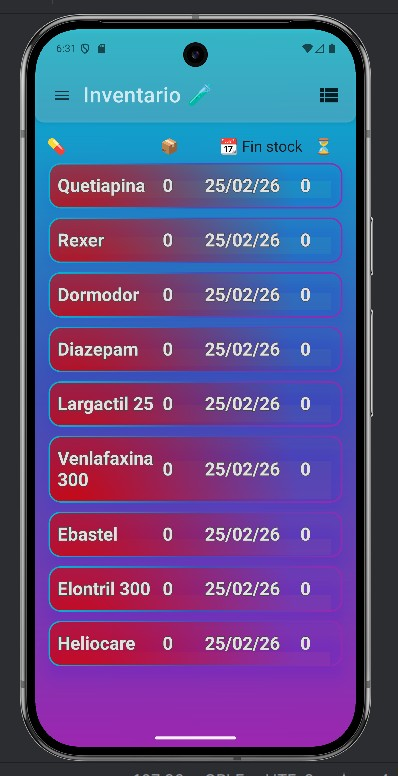
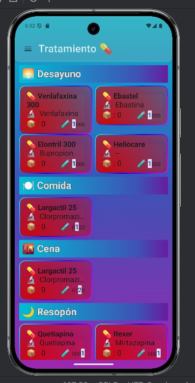
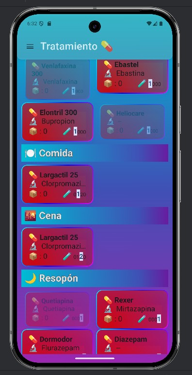
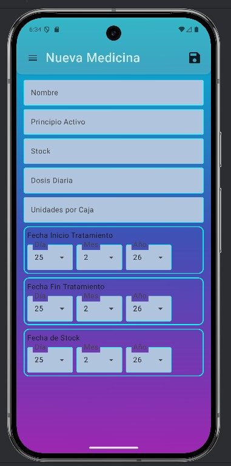
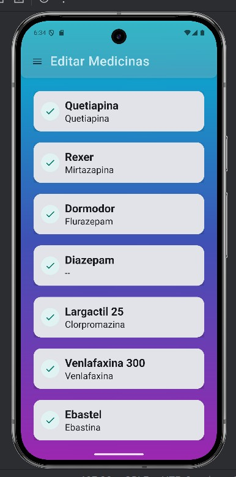
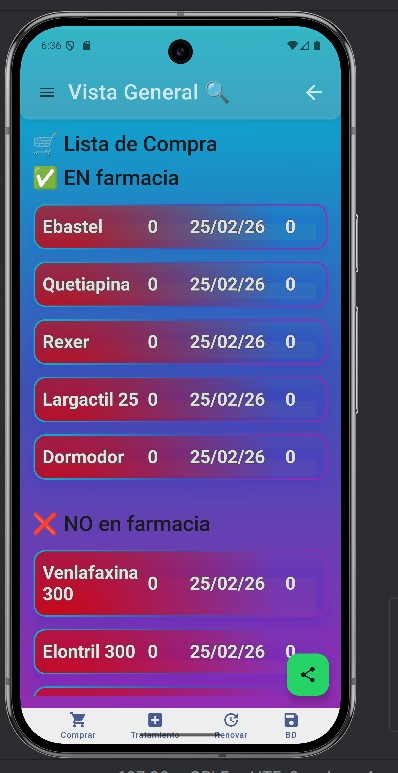

# 💊 MedicacionApp

[](https://kotlinlang.org/)
[](https://developer.android.com/)
[](https://developer.android.com/jetpack/compose)

Aplicación Android para gestionar inventario de medicamentos, controlar tratamientos y calcular automáticamente el consumo y stock disponible.

---

## ✨ Características

### 📦 Gestión de Inventario
- **Lista de medicamentos** con información detallada (nombre, laboratorio, dosis, stock)
- **Alertas visuales por colores** según disponibilidad:
    - 🔴 **Rojo**: 0 semanas (stock crítico)
    - 🟠 **Naranja**: 1 semana
    - 🟡 **Amarillo**: 2 semanas
    - 🟢 **Verde**: 3+ semanas (stock saludable)

### 🧮 Cálculos Automáticos
- **Consumo diario**: Calculado a partir de la suma de los dígitos de la dosis (los 5 cuentan como 0.5)
- **Días disponibles**: Stock ÷ Consumo diario
- **Fecha fin de stock**: Estimación de cuándo se acabará
- **Semanas pendientes**: Cuántas semanas durará el stock actual

### 💉 Gestión de Tratamientos
- Registro de tratamientos activos
- Vinculación con medicamentos del inventario
- Control de duración y renovaciones

### 🛒 Lista de Compra
- Generación automática de lista de compra basada en stock bajo
- Priorización de medicamentos urgentes

---

## 📸 Screenshots

### Inventario con Alertas de Color


### Gestión de Tratamientos



### Añadir/Editar Medicamentos



### Lista de Compra



---

## 🛠️ Tecnologías

| Capa | Tecnología |
|------|------------|
| **Lenguaje** | Kotlin |
| **UI** | Jetpack Compose |
| **Arquitectura** | MVVM |
| **Base de Datos** | Room (SQLite) |
| **Navegación** | Navigation Drawer |
| **Build** | Gradle con Kotlin DSL |

---

## 🏗️ Arquitectura

El proyecto sigue una arquitectura limpia con separación de responsabilidades:

app/src/main/java/com/example/prueba3/
├── data/
│   ├── local/             # Entidades y DAOs de Room
│   └── repository/        # Repositorios para acceso a datos
├── domain/
│   └── model/             # Modelos de dominio (Medicina, etc.)
├── ui/
│   ├── components/        # Componentes reutilizables
│   ├── screens/           # Pantallas de la app
│   └── theme/             # Colores y estilos
├── viewmodel/             # ViewModels (lógica de presentación)
├── navigation/            # Configuración de navegación
└── utils/                 # Utilidades (cálculos, etc.)

### Flujo de Datos
UI (Compose) ←→ ViewModel ←→ Repository ←→ Room Database
↑                                              |
└──────────── StateFlow/Flow ←─────────────────┘

---

## 📋 Requisitos

- **Android Studio**: Ladybug o superior
- **JDK**: 17 o superior
- **SDK Mínimo**: API 24 (Android 7.0)
- **SDK Objetivo**: API 36 (Android 16)

---

## 🚀 Cómo ejecutar

1. **Clonar el repositorio**
   ```bash
   git clone https://github.com/joserodriguezballester/medicacion-app.git
   cd medicacion-app

2. Abrir en Android Studio
   • Abre Android Studio
   • Selecciona "Open" y elige la carpeta del proyecto
   • Espera a que Gradle sincronice las dependencias
3. Ejecutar
   • Conecta un dispositivo Android o inicia un emulador
   • Pulsa el botón "Run" (▶️) o usa Shift + F10

───

🧮 Lógica de Cálculos

Consumo Diario

// Ejemplo: Dosis "121" → 1 + 2 + 1 = 4 comprimidos/día
// Ejemplo: Dosis "25" → 2 + 0.5 = 2.5 comprimidos/día (el 5 vale 0.5)
Fórmulas

• Días Disponibles = stock ÷ consumoDiario
• Fecha Fin de Stock = fechaActual + diasDisponibles
• Semanas Pendientes = diasDisponibles ÷ 7

───

🗺️ Roadmap

• [x] Inventario de medicamentos con Room
• [x] Cálculo automático de consumo y stock
• [x] Alertas visuales por colores
• [x] Gestión de tratamientos
• [x] Lista de compra
• [ ] Notificaciones para medicamentos bajos
• [ ] Exportar/Importar datos (backup)
• [ ] Historial de compras
• [ ] Estadísticas de consumo
• [ ] Modo oscuro

---

## 🎯 Aprendizajes

Este proyecto me ha servido para practicar:

- Arquitectura MVVM y separación de responsabilidades
- Persistencia de datos con Room
- UI declarativa con Jetpack Compose
- Cálculos complejos en tiempo real
- Manejo de estado con StateFlow
- Navigation Drawer
- Lógica de negocio personalizada (cálculo de dosis)

---

## 🤝 Contribuciones

¡Las contribuciones son bienvenidas! Si tienes ideas para mejorar la app:

1. Haz fork del repositorio
2. Crea una rama (`git checkout -b feature/nueva-funcionalidad`)
3. Commit tus cambios (`git commit -m 'Añadir nueva funcionalidad'`)
4. Push a la rama (`git push origin feature/nueva-funcionalidad`)
5. Abre un Pull Request

---

## 📄 Licencia

Este proyecto está bajo la Licencia MIT.

---


  💊 Desarrollado con ❤️ por <a href="https://github.com/joserodriguezballester">Jose Rodriguez Ballester</a>


